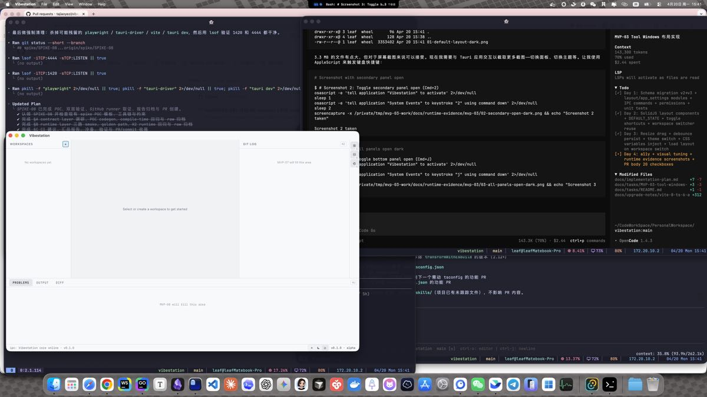
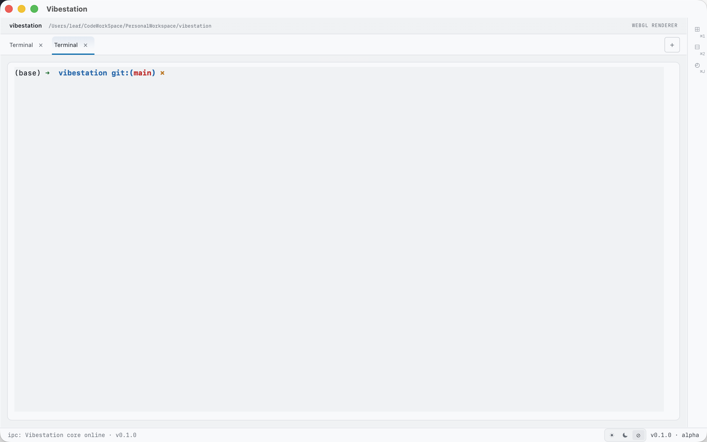
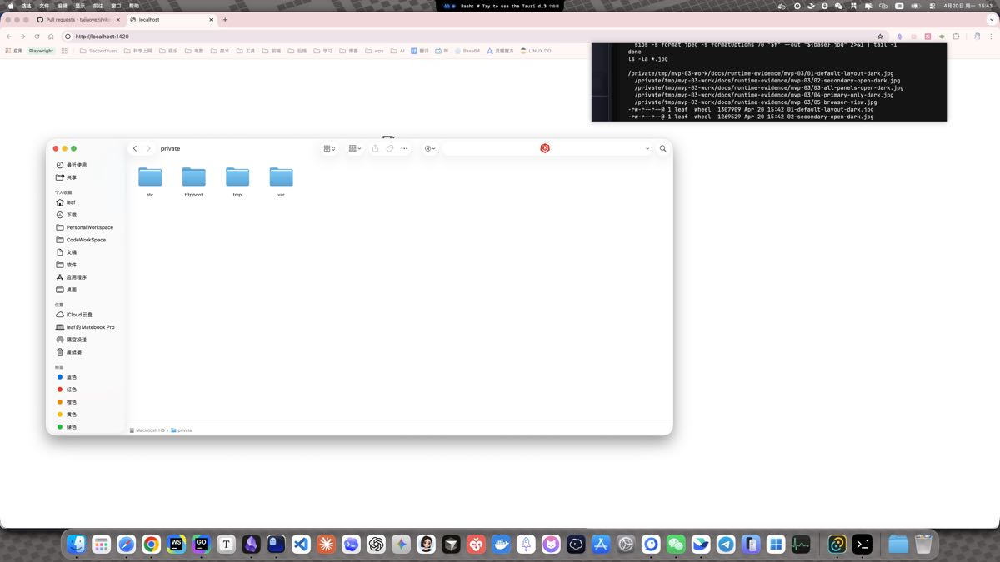
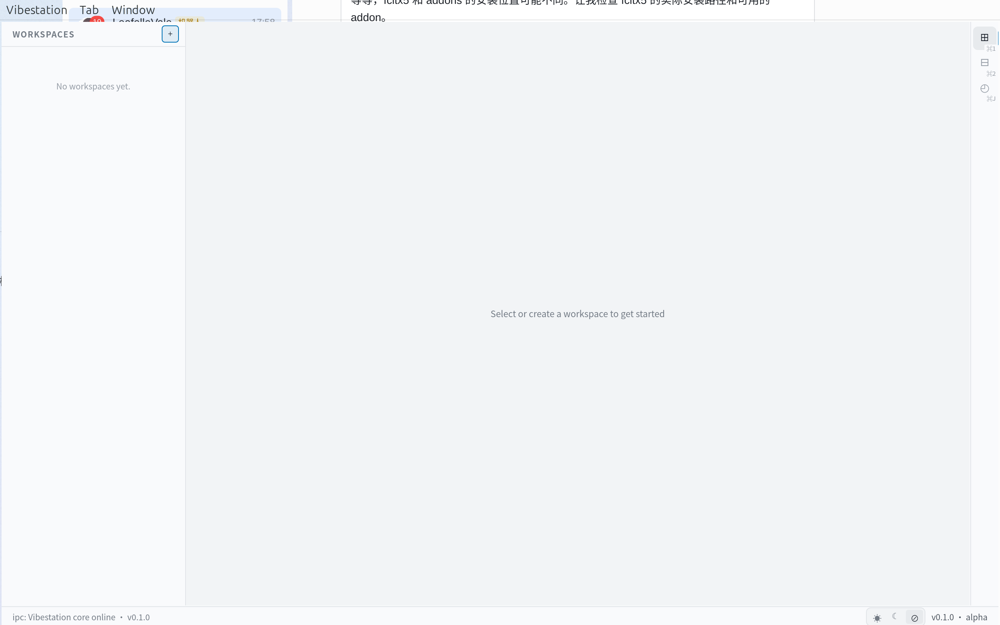

[English](README.en.md) | 中文

**alpha** · **Apache 2.0** · **macOS / Linux**

# Vibestation

为 CLI agent 用户打造的多 Tab 终端 + JetBrains 级 Git 工作台 · Tauri 原生

## 代表性截图




## 为什么是 Vibestation

- **多 Tab 终端** — 一个窗口内创建多个终端 Tab，每个 Tab 一个独立 CLI 会话，适配 Claude CLI / Codex CLI 等工具
- **工作台级 Git** — 内置 Git log / status / diff 视图，无需离开终端切换 IDE 查看 commit
- **跨项目管理** — 单窗口管理多项目，每个 Tab 对应不同项目目录
- **Tauri 原生体验** — 基于 Tauri 2 + Rust 构建，macOS 冷启动 < 200ms，低内存占用
- **Apache 2.0 · 无 CLA** — 开源许可友好，贡献无需签署 CLA

## 现状与版本

Vibestation 处于 **v0.1 alpha** 阶段，开发中，尚未发布正式二进制。终端多 Tab 和 Git 只读视图已可用，更多功能持续开发中。

## 安装

### macOS

从 [GitHub Releases](https://github.com/tajiaoyezi/vibestation/releases) 下载 `.dmg`，拖动到 Applications 后执行：

```bash
xattr -cr /Applications/Vibestation.app
```

> v0.1 未经过 Apple notarize，需手动放行 Gatekeeper。v0.2 将升级 notarize 后自动免除。

### Ubuntu

**deb 包（推荐）**：

```bash
sudo dpkg -i Vibestation_0.1.0_amd64.deb
```

**AppImage（便携）**：

```bash
chmod +x Vibestation_0.1.0_amd64.AppImage
./Vibestation_0.1.0_amd64.AppImage
```

详细安装步骤与常见问题见 [快速上手指南](docs/QUICKSTART.md)。

## 截图墙

### 终端




### Git


### 主题与平台





## 路线图

| 里程碑   | 内容                                                                                                        |
| -------- | ----------------------------------------------------------------------------------------------------------- |
| **v0.1** | 多 Tab 终端 · Git log/status 只读 · Commit · 基础 Diff · 单层 Pane · 配置导入 · 崩溃恢复 · macOS-first 发布 |
| **v0.2** | Push/Pull/Fetch · Rail graph · 分支管理 · Pane 任意嵌套                                                     |
| **v0.3** | Rebase/Merge/Cherry-pick · 冲突解决 · Pop to External                                                       |
| **v1.0** | 高级工作流能力 · 详见 [`implementation-plan.md`](docs/implementation-plan.md)                               |

## 贡献

贡献流程已就绪，详见 [CONTRIBUTING.md](CONTRIBUTING.md)。

## 许可证

Apache License 2.0 — 不要求签署 CLA。详见 [LICENSE](LICENSE)。

## 深入了解

开发者向的仓库结构、规划成果、锁定决策与非目标，详见 [docs/PROJECT-OVERVIEW.md](docs/PROJECT-OVERVIEW.md)。
