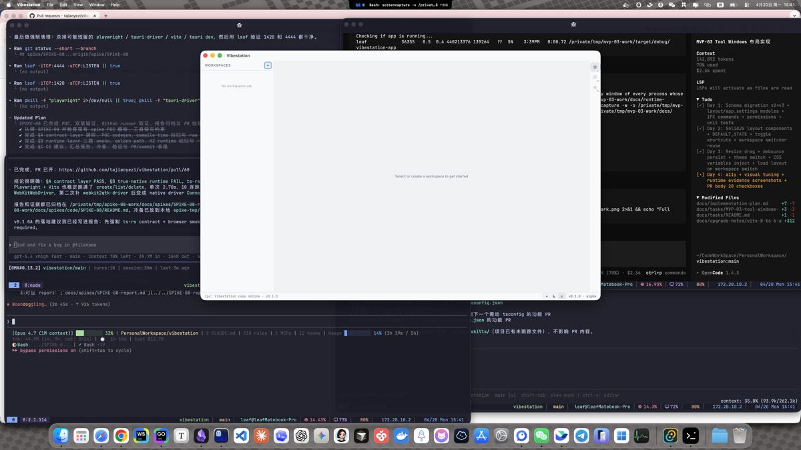
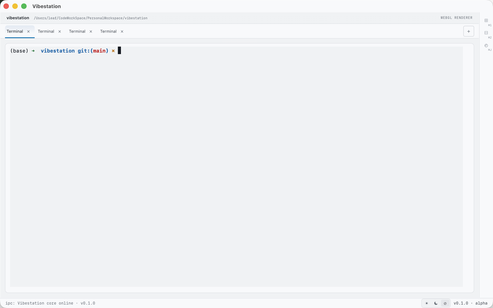
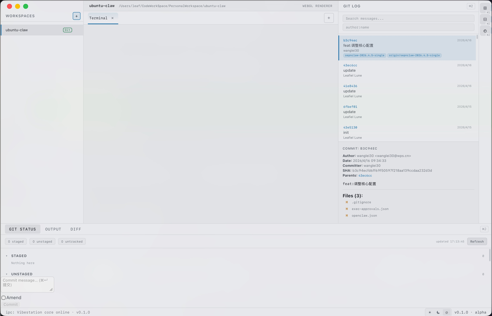
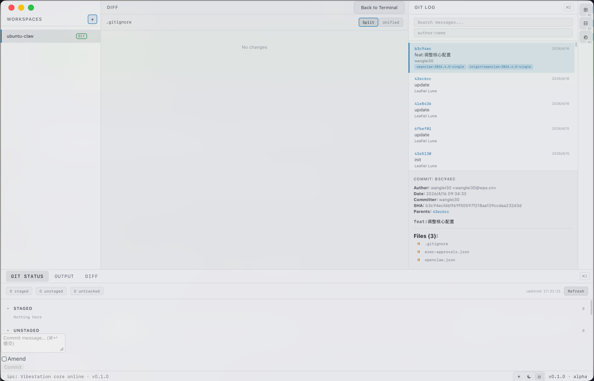
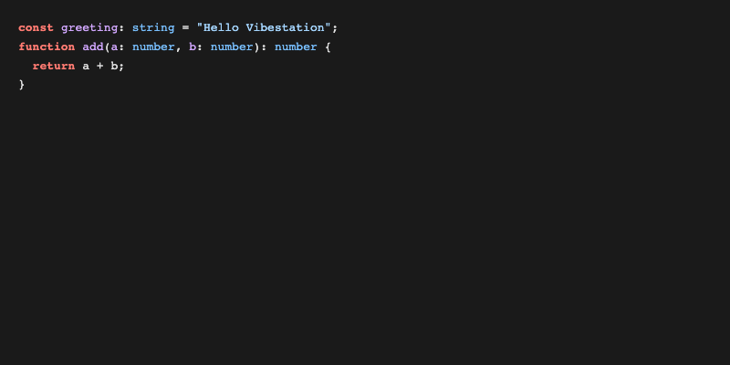

[中文](./QUICKSTART.md) | English

# Vibestation Quickstart

## Introduction / Who Is This For

Vibestation is a multi-tab terminal + JetBrains-grade Git workbench built for CLI agent users, powered by Tauri 2 + Rust for a native desktop experience. This guide will help you install and run through the core workflow in 5–10 minutes.

This guide is for:

- Developers who use command-line tools like Claude CLI, Codex CLI, and similar tools daily
- Users who need to manage multiple terminal sessions and projects in a single window
- Engineers who want to view Git log, status, and diff directly in the terminal
- Early adopters interested in Tauri / Rust desktop applications

## System Requirements

| Platform | Minimum Requirements                                                  |
| -------- | --------------------------------------------------------------------- |
| macOS    | macOS 13 (Ventura) or later · Apple Silicon (arm64) or Intel (x86_64) |
| Ubuntu   | Ubuntu 24.04 (24 LTS) or later · x86_64                               |

> Windows support is planned for v0.4. Currently only macOS and Ubuntu 24 LTS are supported.

## Installation

### macOS · DMG

1. Download the latest `.dmg` file from [GitHub Releases](https://github.com/tajiaoyezi/vibestation/releases)
2. Open the DMG and drag Vibestation to the Applications folder
3. Before first launch, run the following command in Terminal to remove the quarantine attribute:

```bash
xattr -cr /Applications/Vibestation.app
```

> **Why is this needed?** The v0.1 release is not Apple-notarized, so macOS Gatekeeper will block the unnotarized app from launching. Running `xattr -cr` removes the quarantine flag, allowing the system to proceed. Future versions will complete the notarization process, making this step unnecessary.

### Ubuntu · deb

1. Download the `.deb` package from [GitHub Releases](https://github.com/tajiaoyezi/vibestation/releases)
2. Install:

```bash
sudo dpkg -i Vibestation_0.1.0_amd64.deb
```

3. Uninstall (if needed):

```bash
sudo dpkg -r vibestation
```

Or use apt:

```bash
sudo apt remove vibestation
```

### Ubuntu · AppImage

1. Download the `.AppImage` file from [GitHub Releases](https://github.com/tajiaoyezi/vibestation/releases)
2. Add execute permission:

```bash
chmod +x Vibestation_0.1.0_amd64.AppImage
```

3. Run:

```bash
./Vibestation_0.1.0_amd64.AppImage
```

> AppImage requires no installation — just run it directly. Ideal for users who prefer not to use a package manager.

## First Launch Checklist

After launching Vibestation, verify the following:

- [ ] Application window displays normally, no crash or white screen
- [ ] Left sidebar is visible, showing workspace navigation
- [ ] Bottom terminal area has loaded the default Shell (e.g., bash / zsh)
- [ ] Top title bar shows the current project path
- [ ] Shortcut `Cmd+T` (macOS) / `Ctrl+T` (Ubuntu) creates a new tab

## Getting Started in 5 Steps

### Step 1 · Open the App

When Vibestation launches, you will see the default dark layout: the left sidebar shows workspace navigation, the bottom area contains the terminal, and the right panel can expand to show Git views.



> On first launch, Vibestation automatically detects the current directory and loads the corresponding Shell configuration. If the display looks incorrect, check that your system meets the requirements.

### Step 2 · Create a Tab and Run CLI

Use the shortcut `Cmd+T` (macOS) or `Ctrl+T` (Ubuntu) to create a new terminal tab. Each tab has an independent Shell session — you can run Claude CLI, Codex CLI, or other command-line tools in separate tabs.



> You can also create tabs via the "+" button in the sidebar or the right-click context menu. Each tab can have its own working directory.

### Step 3 · View Git Log

Click the Git icon in the sidebar or use a shortcut to open the Git view and browse the commit history of the current repository. Each commit shows the author, timestamp, and message summary.



> The Git view automatically detects the Git repository in the current tab's working directory. If nothing appears, verify the directory contains a `.git` folder.

### Step 4 · View Diff

In the Git view, click a commit to see its file changes on the right side, with an overlay view showing added, deleted, and modified lines.



> The Diff view supports syntax highlighting for a clear look at code changes. Future versions will support staging area diff and inline diff.

### Step 5 · Switch Theme

Vibestation supports dark and light themes. Open settings via the settings panel or shortcut `Cmd+,` (macOS) / `Ctrl+,` (Ubuntu), then switch under the Appearance option.



> Theme switching takes effect immediately — no restart needed. You can also follow the system theme for automatic switching.

## FAQ

### macOS shows "Cannot open the application" at launch

This is Gatekeeper blocking an unnotarized app. Run `xattr -cr /Applications/Vibestation.app` in Terminal to allow it. See the macOS · DMG section in Installation for details.

### Double-clicking the AppImage on Ubuntu does nothing

The AppImage needs execute permission. Run `chmod +x Vibestation_0.1.0_amd64.AppImage` in a terminal, then launch with `./Vibestation_0.1.0_amd64.AppImage`.

### Git view appears empty

Make sure the current tab's working directory is a Git repository (contains a `.git` directory). Vibestation automatically detects Git repos and displays commit history.

## Next Steps

- 🤝 Contribute: Read [CONTRIBUTING.md](../CONTRIBUTING.md)
- 📊 Track development progress: See [docs/PROGRESS.md](./PROGRESS.md)
- 🗺️ View the product roadmap: Jump to [README.en.md roadmap](../README.en.md#roadmap)
