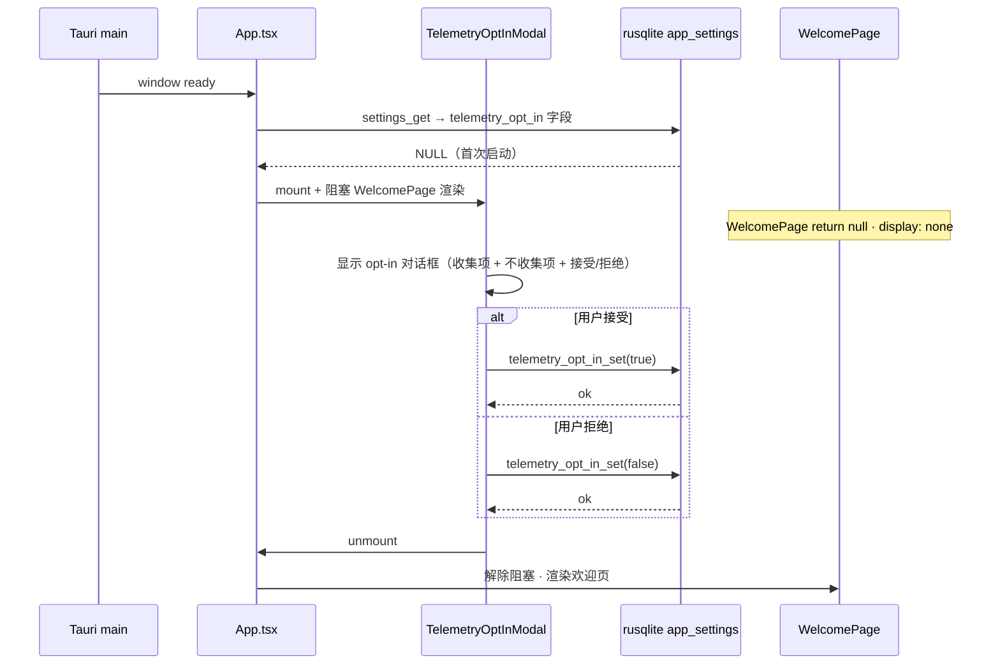

# MVP-10: 设置 + Telemetry + 打包发布

> **状态**：`ready`
> **依赖**：所有 MVP-01..09（发布前收尾）
> **v0.1 GA 硬门槛**

---

> ⚠️ **2026-05-20 · capture mandate removed**（ADR-023 supersede ADR-011）：本 spec 中所有 **"§F.04 DevTools network panel / 截图 / GUI capture / runtime evidence" 类 acceptance 项 / Phase 表行 / 起点 hint 段** 已 supersede · 不再阻塞 spec done flip。inline 文字保留作 audit 历史 · 但**功能上 deprecated**。代码侧 acceptance（app_settings::tests:: 9 + Sentry SDK 19 测试 + PII SHA-256 hash + Linux AppImage 7.61 MB + sha256 + X11 启动验证）保留为 done gate。`docs/runtime-evidence/mvp-10/CAPTURE-GUIDE.md` 已 deprecated · 由 PR-4 删除。已捕 evidence（§F.01/02/03 4 PNG + sentry-spike/ 3 截图 + phase-d/ Linux AppImage 证据）保留作 v0.1 ship audit。

---

## 🎯 目标（Goal）

完成 v0.1 发布前的最后一个 MVP：设置面板、Telemetry 首次启动 opt-in 对话框、macOS 公证、Linux AppImage 签名、README/CHANGELOG/SECURITY 就位。

## 📖 背景（Context）

- `CLAUDE.md` #10（A 栏）：Telemetry = **默认关闭 + 首次启动弹 opt-in**（匿名 crash + 版本号，GDPR/CCPA 合规）
- `§10.4 非功能`：LICENSE / NOTICE / CONTRIBUTING / CoC / CHANGELOG / SECURITY / privacy policy 全部就位
- `§9 R30`：Telemetry 隐私合规（默认关 + opt-in）

---

## 🎨 功能范围（Scope）

**Do**：

- 设置面板（Settings app window 或 drawer）：
  - 外观：theme（light/dark/auto）+ font family / size
  - 终端：default shell + pasta 保护 toggle
  - Git：user.name / user.email（从 git config 读取 + 可改）
  - 隐私：Telemetry opt-in toggle + "查看收集内容"链接
- 首次启动 Telemetry opt-in 对话框（MVP-01 启动后、欢迎页前）
- 对话框内容：
  - 收集什么（匿名 crash + 版本号 + OS type 三项，无 IP、无个人内容、无仓库路径）
  - 不收集什么（强调）
  - 接受 / 拒绝 按钮（等宽）+ "Learn more" 链接到 privacy policy
- 用户决策持久化到 rusqlite `app_settings`
- 打包发布：
  - macOS 公证（notarization）+ stapling
  - Linux AppImage + sha256 + GPG 签名（可选）
  - 版本号 `0.1.0`
- 非功能文件：
  - README.md（双语简版 + 对外文案禁区合规）
  - CONTRIBUTING.md
  - CODE_OF_CONDUCT.md（Contributor Covenant 2.1）
  - CHANGELOG.md（Keep a Changelog）
  - SECURITY.md（报告邮箱）
  - privacy-policy.md

**Don't**：

- Telemetry 服务端（收集端点由 CI 期间 Phase 4 做）
- Auto-update 服务端（Tauri plugin 已集成但 update manifest 服务端 v0.2+）
- Windows 打包(v0.4)
- ARM Linux（v0.2）

## 🛠 实施进度

MVP-10 估时 5 d · 拆 5 Phase 实施（Phase A/B 可在 MVP-01..09 收尾期间并行启动 · Phase C/D/E 必须等 MVP-01..09 全 done）：

| Phase                                                  | 范围                                                                                                                                                                     | 依赖                                                                   | 状态                                                                                                                                                                                                                                                                                                                                                                                                                                                                                                                                                                                                                                                                                                                                                                           | PR                                                                                                                                                                                                                                                                                                                                                                   |
| ------------------------------------------------------ | ------------------------------------------------------------------------------------------------------------------------------------------------------------------------ | ---------------------------------------------------------------------- | ------------------------------------------------------------------------------------------------------------------------------------------------------------------------------------------------------------------------------------------------------------------------------------------------------------------------------------------------------------------------------------------------------------------------------------------------------------------------------------------------------------------------------------------------------------------------------------------------------------------------------------------------------------------------------------------------------------------------------------------------------------------------------ | -------------------------------------------------------------------------------------------------------------------------------------------------------------------------------------------------------------------------------------------------------------------------------------------------------------------------------------------------------------------- |
| Phase A · 设置面板                                     | 4 分组 SolidJS 组件（外观/终端/Git/隐私）+ AppSettings KV store + ⌘, 快捷键                                                                                              | 无（可与 MVP-01..09 并行）                                             | ✅ done                                                                                                                                                                                                                                                                                                                                                                                                                                                                                                                                                                                                                                                                                                                                                                        | [#114](https://github.com/tajiaoyezi/vibestation/pull/114)                                                                                                                                                                                                                                                                                                           |
| Phase B · Telemetry opt-in + Sentry 集成               | 首次启动对话框（阻塞欢迎页）+ Sentry SDK 集成 + PII 脱敏 + opt-in 状态持久化 + 设置 toggle 实时生效                                                                      | Phase A（设置面板存在才能改 toggle） + ADR-015 accepted                | ✅ done · ADR-015 accepted [#152](https://github.com/tajiaoyezi/vibestation/pull/152) · SDK 编码 [#155](https://github.com/tajiaoyezi/vibestation/pull/155)（4 commits · 19 测试全过 · `default_integrations: false` + PII SHA-256 hash + before_send 删 trace）· §C.4 endpoint UI + §G.4 H2 proof + §F capture guide [#158](https://github.com/tajiaoyezi/vibestation/pull/158) · §B.1 modal mount-time click guard [#161](https://github.com/tajiaoyezi/vibestation/pull/161) **critical bug fix**（webview 启动 race · 200ms guard）· §F.02 theme dual-path fix [#163](https://github.com/tajiaoyezi/vibestation/pull/163) **secondary fix**（ThemeProvider listen settings_changed event · 实时生效闭环）· §F evidence 3/4 done（01/02/03 · 仅 §F.04 DevTools 待 Arbiter） | [ADR-015](../adr/ADR-015-telemetry-stack-sentry.md) · [#152](https://github.com/tajiaoyezi/vibestation/pull/152) / [#155](https://github.com/tajiaoyezi/vibestation/pull/155) / [#158](https://github.com/tajiaoyezi/vibestation/pull/158) / [#161](https://github.com/tajiaoyezi/vibestation/pull/161) / [#163](https://github.com/tajiaoyezi/vibestation/pull/163) |
| Phase C · macOS 公证 + notarization                    | tauri-cli build → signed `.app` + `.dmg` + notarytool submit + stapling + Gatekeeper 验证                                                                                | Phase A/B done · MVP-01..09 全 done · Apple Developer Program approved | 🟡 **deferred to v0.2** · v0.1 GA 改 unsigned 模式 · README + Release notes 写明 Gatekeeper bypass 指引（`xattr -cr /Applications/Vibestation.app`）· $99/y + 2-2 周审批不阻塞 v0.1 alpha 发版 · v0.2 升级触发：README 反馈"装不上"超 5 次 / 公开 landing page 上线 / macOS 用户基础超 100 任一即触发                                                                                                                                                                                                                                                                                                                                                                                                                                                                          | —                                                                                                                                                                                                                                                                                                                                                                    |
| Phase D · Linux AppImage + sha256                      | tauri-cli build → AppImage（< 80 MB）+ sha256 校验和 + Ubuntu 24 Wayland/X11 启动验证                                                                                    | Phase A/B done · MVP-01..09 全 done                                    | ✅ done · 7.61 MB AppImage（< 80 MB · 余量 10.5×）+ sha256 + X11 启动验证（Ubuntu 24.04.4 LTS · GNOME on X11 · 截图 1920×1080 / 135 KB）· Wayland skip（当前 session X11 · follow-up：Ubuntu 用户切 Wayland session 重测 · 主 agent macOS 无法补测）· GPG skip（spec 标可选 · v0.2）· icon 命名 follow-up（`Vibestation.png` → `vibestation-app.png` symlink · 当前手动补丁 · v0.2 改 `tauri.conf.json`）· 证据 `docs/runtime-evidence/mvp-10/phase-d/`                                                                                                                                                                                                                                                                                                                        | [#174](https://github.com/tajiaoyezi/vibestation/pull/174)                                                                                                                                                                                                                                                                                                           |
| Phase E · 非功能文件 + GitHub Release（unsigned 模式） | README/CONTRIBUTING/CoC/CHANGELOG/SECURITY/privacy-policy + v0.1.0 tag + unsigned macOS .dmg + Linux .deb/.AppImage + Release page assets + macOS Gatekeeper bypass 指引 | Phase A/B/D done（Phase C 推 v0.2）                                    | ⏳ todo · 非功能文件全已存在（README/CONTRIBUTING/CoC/CHANGELOG/SECURITY/privacy-policy）· Linux artifact 已就位（PR #174 · 7.61 MB AppImage + sha256）· 仅缺 v0.1.0 tag + unsigned macOS .dmg artifact                                                                                                                                                                                                                                                                                                                                                                                                                                                                                                                                                                        | —                                                                                                                                                                                                                                                                                                                                                                    |

**下次 agent 起点**（2026-05-20 · capture mandate removed · ADR-023）：Phase A/B/D 全 done · §F.04 DevTools network panel manual capture 已 deprecated（实际 v0.1.0/v0.1.1 已 ship · code-side Sentry SDK 19 测试 + PII hash 验过）。**Phase C 推 v0.2**（Apple Dev Program $99/y + 2-2 周审批不阻塞 v0.1 alpha 发版 · v0.1 改 unsigned dmg + README Gatekeeper bypass 指引模式 · 见 §I.D §K 风险段）。**Phase E** v0.1.0 tag + unsigned macOS .dmg + Linux artifact + GitHub Release（unsigned 模式）历史已 ship · MVP-10 spec status flip done 由 PR-5 统一执行。

**依赖关系说明**：

- Phase A/B 文件域：`crates/core/src/app_settings.rs`（已存在 · MVP-03 Phase A 建）+ `crates/app/src/lib.rs`（IPC 注册）+ `web/src/panels/Settings/`（新建）+ `web/src/dialogs/TelemetryOptIn/`（新建）
- Phase C/D 文件域：`tauri.conf.json`（bundle 配置）+ `.github/workflows/release.yml`（CI 打包流程）+ `scripts/release.sh`（可选本地打包脚本）
- Phase E 文件域：根目录非功能文件 · 不动代码

**Phase A 实施起点 checklist**（让 agent 接 spec 后 5 min 内启动）：

- [x] `crates/core/src/app_settings.rs` 已存在（MVP-03 Phase A · KV 表 + `AppSettingsStore::get/set`）· 不需要新建 · 仅扩展
- [x] migration 不新建（§数据模型变更已锁 · MVP-10 纯 KV 写入 · 无 schema 变更 · 仿 YAGNI）· 新增 8 个 KV key（`telemetry_opt_in` / `paste_protection` / `default_shell` / `font_family` / `font_size` / `theme` / `git_user_name` / `git_user_email`）
- [ ] `AppSettings` struct（§G.2 已写完整）→ `AppSettingsStore::get_all()` 实现 · 用 SQL `SELECT key, value FROM app_settings` 一次拉所有 KV · Rust 侧组装 `AppSettings` struct · **推 Phase B**（需 IPC `settings_get` 接通）
- [ ] `SettingsUpdateRequest` 实现 partial update · 仅含 `Some` 字段触发 `SET` · `None` 字段跳过 · **推 Phase B**（需 IPC `settings_update` 接通）
- [ ] IPC commands 注册顺序（`crates/app/src/lib.rs` `invoke_handler!`）：
  - `settings_get` / `settings_update` / `telemetry_opt_in_set` / `telemetry_status_get` / `app_version_get` · **推 Phase B**
- [ ] permission toml：`crates/app/permissions/settings.toml` + `telemetry.toml` 新建（5 个 permission）· **推 Phase B**
- [ ] capability `default.json` 引用上述 permission · **推 Phase B**
- [ ] ts-rs binding 自动生成到 `web/src/bindings/`（`build.rs` 触发 · 6 个 struct 见 §G.1）· **推 Phase B**
- [x] SolidJS Settings 组件结构：`web/src/panels/Settings/SettingsPanel.tsx`（4 分组）+ `AppearanceGroup.tsx` + `TerminalGroup.tsx` + `GitGroup.tsx` + `PrivacyGroup.tsx`
- [ ] 实时生效路径：Settings UI 修改 → `invoke('settings_update', { theme: 'dark' })` → Rust 侧写 KV → emit Tauri event `'settings_changed'` → 全局 SolidJS store 更新 → 主题 CSS 变量切换（< 100 ms）· **Phase A store level 已实现（theme 切 `useTheme`）· Rust KV 持久化推 Phase B**

## 🖼 UI 引用

- 设置面板：参考原型的 modal / drawer（Calm Studio 风格）
- Telemetry 对话框：顶部 icon + 清晰文字 + 两个等宽按钮（拒绝在左，接受在右）

## ✅ Acceptance

### A. 设置面板

- [ ] A.1 `⌘,`（macOS）或菜单 `Vibestation → Preferences` 打开设置面板；Linux 对应 `Ctrl+,` 或 hamburger 菜单
- [ ] A.2 4 个分组显示：外观 / 终端 / Git / 隐私；每个分组可折叠
- [ ] A.3 所有改动实时生效：主题切换后 < 100 ms UI 可见变化；字体改动后终端即时重渲染；rusqlite UPDATE `app_settings` P99 < 50 ms（本地 SSD）
- [ ] A.4 持久化到 rusqlite `app_settings`：重启应用后设置值一致（integration test 覆盖）

### B. Telemetry opt-in 对话框

- [ ] B.1 首次启动（rusqlite 无 `telemetry_opt_in` 决策，即值为 NULL）弹对话框，阻塞欢迎页渲染；启动顺序：Tauri window ready → opt-in modal mount → 用户决策前 WelcomePage 组件 return null 或 `display: none`
- [ ] B.2 对话框列出：收集项（匿名 crash + 版本号 + OS type）+ 不收集项（IP、个人文件路径、commit 信息、终端内容、仓库名）+ 设置 → 隐私可改
- [ ] B.3 用户选择"接受"后写入 `telemetry_opt_in = true`，选择"拒绝"后写入 `telemetry_opt_in = false`；再次启动时 `telemetry_opt_in IS NOT NULL` 不再弹对话框
- [ ] B.4 设置里改 toggle 立即生效：true → 开始发送 crash；false → 立即停止发送（当前 session 已排队的 crash flush 后不再新增）

#### §B.1.1 · 首次启动时序图（mermaid · 实施 agent 用）



**实施约定**：

- `WelcomePage` 组件用 SolidJS `Show` 包裹：`<Show when={telemetryOptInDecided()} fallback={null}>`
- `telemetryOptInDecided` signal：mount 时 `invoke('settings_get')` 读 `telemetry_opt_in` · NULL → false / 非 NULL → true
- 用户决策后：emit `'settings_changed'` event → 重新读 settings → `telemetryOptInDecided()` 变 true → WelcomePage 渲染
- 后续启动：`telemetry_opt_in IS NOT NULL` → `telemetryOptInDecided()` 直接 true · `TelemetryOptInModal` 不 mount

### C. Telemetry 实际行为

- [ ] C.1 `opt-in = false`：**不发送任何遥测**（包括 crash report）；network panel / 代理验证 0 个 outbound 请求到 telemetry endpoint
- [ ] C.2 `opt-in = true`：发送匿名 crash + 版本号 + OS type（macos / linux）；payload 含 `{"version":"0.1.0","os_type":"macos","stack_trace_hash":"abc123..."}`，不含用户标识
- [ ] C.3 crash report 不含：IP / 用户文件路径 / commit 信息 / 终端内容；proof 步骤：(a) unit test 构造带 PII 的 panic（路径 `~/secret/`、commit hash `abc1234`）→ (b) 捕获 payload → (c) assert 正则 `/(?i)(ip|path|commit|content)/` 不匹配 → (d) ts-rs 类型检查兜底（`CrashReportPayload` 不含 PII 字段）
- [ ] C.4 收集端点 URL 在设置 → 隐私里公开显示，用户可复制

#### §C.3.1 · PII 脱敏 unit test 模板（Phase B 实施时必加）

新建 `crates/core/tests/telemetry_pii_test.rs`：

```rust
use vibestation_core::telemetry::{capture_panic, CrashReportPayload};

#[test]
fn capture_panic_strips_pii() {
    // 构造含 PII 的 panic：用户路径 + commit hash + IP
    let panic_info = "thread 'main' panicked at 'Failed to read /Users/alice/secret/file.txt: \
                      commit abc1234567890abcdef · IP 192.168.1.42'";
    let payload: CrashReportPayload = capture_panic(panic_info);

    // (c) assert 正则白名单 · 不含 PII
    let payload_json = serde_json::to_string(&payload).unwrap();

    // 不含用户路径
    assert!(!payload_json.contains("/Users/alice"));
    assert!(!payload_json.contains("secret"));

    // 不含 commit hash 全文（仅 stack_trace_hash · 是 SHA-256 哈希值）
    assert!(!payload_json.contains("abc1234567890abcdef"));

    // 不含 IP
    let ip_regex = regex::Regex::new(r"\d{1,3}\.\d{1,3}\.\d{1,3}\.\d{1,3}").unwrap();
    assert!(!ip_regex.is_match(&payload_json));

    // (d) ts-rs 类型检查兜底：CrashReportPayload struct 字段白名单
    // 编译时已保证（§G.2 derive 模板）· 但加运行时断言双保险
    assert_eq!(payload.version, "0.1.0");
    assert!(!payload.os_type.is_empty());
    assert!(payload.stack_trace_hash.len() == 64); // SHA-256 hex = 64 chars
}

#[test]
fn capture_panic_handles_terminal_content() {
    // 边界：panic 包含终端内容（用户输入的命令）· 必须脱敏
    let panic_info = "panic at 'parse error in user input: rm -rf ~/Documents'";
    let payload = capture_panic(panic_info);
    let payload_json = serde_json::to_string(&payload).unwrap();
    assert!(!payload_json.contains("rm -rf"));
    assert!(!payload_json.contains("Documents"));
}

#[test]
fn capture_panic_handles_repo_path() {
    // 边界：panic 包含 git repo 路径 · 必须脱敏
    let panic_info = "panic at '/Users/alice/work/secret-project/.git/HEAD missing'";
    let payload = capture_panic(panic_info);
    let payload_json = serde_json::to_string(&payload).unwrap();
    assert!(!payload_json.contains("secret-project"));
    assert!(!payload_json.contains("alice"));
}
```

**实施约定**（Phase B）：

- `crates/core/src/telemetry.rs` 新建 · `capture_panic(panic_info: &str) -> CrashReportPayload`
- 内部用 `sha2` crate 算 SHA-256(panic_info) → `stack_trace_hash`
- 仅保留 OS type + version + `stack_trace_hash` 3 字段（`CrashReportPayload` struct 已锁 §G.2）

### D. macOS 打包（v0.1 alpha · unsigned 模式 · v0.2 升级 notarized）

> **决策（session 20 · 2026-04-26）**：v0.1 alpha 改 unsigned 模式 · 不付 Apple Developer Program（$99/y）· 不等 2-2 周审批 · README + Release notes 写明 Gatekeeper bypass 指引。v0.2 触发条件（任一）：(1) README 反馈"装不上"超 5 次；(2) 公开 landing page 上线；(3) macOS 用户基础超 100。届时升级 D.1-D.4 原计划。

#### D · v0.1 unsigned 模式（v0.1 GA 接受）

- [ ] D.unsigned.1 `pnpm tauri build` 在 macOS 产出 unsigned `.app` + `.dmg`（`--target aarch64-apple-darwin` + `x86_64-apple-darwin` 分别构建）· 体积 < 30 MB
- [ ] D.unsigned.2 README + Release notes 含完整 macOS 安装指引：`xattr -cr /Applications/Vibestation.app` bypass 命令 + 三步图文（下载 / 拖动 Applications / Terminal 跑 xattr）
- [ ] D.unsigned.3 实机验证：干净的 macOS（未给开发者豁免）双击 `.dmg` → 拖动 → 按指引跑 xattr → 双击 `.app` 启动 ✓
- [ ] D.unsigned.4 Release notes 醒目标"unsigned alpha · v0.2 升级 notarized"

#### D · v0.2 notarized 升级路径（推迟 · 不阻塞 v0.1）

- [ ] D.notarized.1 `pnpm tauri build` 在 macOS 产出 signed `.app` + `.dmg`（`--target universal-apple-darwin` 或分别 `x86_64` / `aarch64`）· 依赖 Developer ID Application 证书
- [ ] D.notarized.2 公证通过：`xcrun notarytool submit Vibestation.dmg --wait` exit code 0，日志无 Invalid / Rejected
- [ ] D.notarized.3 Stapling 完成：`xcrun stapler staple Vibestation.dmg` exit code 0；`spctl -a -vv Vibestation.dmg` 输出含 `accepted`
- [ ] D.notarized.4 Gatekeeper 干净的 mac 可直接打开：`xattr -l Vibestation.app` 无 `com.apple.quarantine` 阻止标记；或实机双击无"无法验证开发者"弹窗

### E. Linux 打包

- [ ] E.1 AppImage 产出：单文件，大小 < 80 MB（ADR-005 存储约束 + `implementation-plan.md §10.2`）
- [ ] E.2 sha256 校验和：`sha256sum Vibestation-0.1.0-linux-x86_64.AppImage > Vibestation-0.1.0-linux-x86_64.AppImage.sha256`，文件与 AppImage 同目录发布
- [ ] E.3 Ubuntu 24 Wayland + X11 都可启动：`./Vibestation-0.1.0-linux-x86_64.AppImage --version` exit code 0 且窗口可见（Wayland 会话 + XWayland fallback 各测一次）；若 Ubuntu 24 环境仍缺，记 known limitation 并延到 v0.1.0-alpha 后评估
- [ ] E.4 （可选）GPG 签名 AppImage：若实现，`gpg --detach-sign --armor` 产出 `.asc` 文件

### F. 非功能文件

- [ ] F.1 `README.md` 双语（英/中），首屏 100 字内说明"多 Tab 终端 + JetBrains 级 Git 工作台"；grep 确认 0 处 `AI-Aware` / `Mission Control` / `AI session aware`（禁区，见 `CLAUDE.md §🚫`）
- [ ] F.2 `CONTRIBUTING.md` 说明 PR 流程（feature branch + PR + review）+ 代码风格（cargo fmt / pnpm lint / Conventional Commits）
- [ ] F.3 `CODE_OF_CONDUCT.md` Contributor Covenant 2.1（已有，验证版本号）
- [ ] F.4 `CHANGELOG.md` Keep a Changelog 格式，`## [0.1.0] - YYYY-MM-DD` 段含 Added/Changed/Fixed/Removed 分类；内容与 GitHub Release notes 一致
- [ ] F.5 `SECURITY.md` 含有效安全报告邮箱（格式验证：`grep -E '[a-zA-Z0-9._%+-]+@[a-zA-Z0-9.-]+\.[a-zA-Z]{2,}' SECURITY.md` 命中 ≥ 1 处）
- [ ] F.6 `privacy-policy.md` 公开 + 设置里链接；内容覆盖 GDPR Article 13 最小 6 项：收集什么 / 为什么 / 保留多久 / 第三方分享 / 用户权利 / 联系方式

### G. GitHub Release

- [ ] G.1 `v0.1.0` tag + Release 页面：tag 格式严格为 `v0.1.0`（前缀 `v`，不是 `0.1.0`）
- [ ] G.2 上传 asset 命名规范：
  - `Vibestation-0.1.0-macos-x86_64.dmg`
  - `Vibestation-0.1.0-macos-aarch64.dmg`
  - `Vibestation-0.1.0-linux-x86_64.AppImage`
  - 每个 `.dmg` / `.AppImage` 配同名 `.sha256`
- [ ] G.3 Release notes 来自 `CHANGELOG.md`：手动或 release-please 从 `## [0.1.0]` 段提取；GitHub Release 页面正文与 CHANGELOG 该段差异 ≤ 5%（允许格式微调）

## 🧪 测试策略

| 层次    | 范围                                                                |
| ------- | ------------------------------------------------------------------- |
| 单元    | Telemetry payload 脱敏（C.3 正则断言）+ 设置持久化（rusqlite 读写） |
| 集成    | 设置变更 → rusqlite 写入 → 进程重启 → 读取一致                      |
| E2E     | 完整首次启动流程（Telemetry 对话框 → 决策 → 欢迎页）                |
| 手动 QA | 三平台打包验证 + notarization 实机测试 + Gatekeeper 干净 mac        |

## 📸 运行时证据要求

按 [ADR-011](../adr/ADR-011-runtime-evidence-location.md) + [ADR-023](../adr/ADR-023-capture-mandate-removed.md)（capture mandate 已移除）· MVP-10 实施 PR 证据要求已弃用，以下证据列表保留作历史 audit 归档：

- `01-settings-panel.png`（设置面板打开 · 4 分组显示）
- `02-settings-realtime.png`（改 theme 后实时生效 · 无重启）
- `03-telemetry-opt-in.png`（首次启动 opt-in 对话框 · 阻塞欢迎页）
- `04-telemetry-decline.png`（用户拒绝后 · 不发送遥测的 network log 或 console proof）
- `05-macos-dmg-notarized.png`（`spctl -a -vv` 输出 · 证明公证 + stapling）
- `06-linux-appimage-run.png`（Ubuntu 24 启动 AppImage · 窗口显示 · 若环境就绪）
- `07-github-release.png`（`v0.1.0` Release 页面 · assets 清单）
- 可选：`demo.mp4` 60s · 串起设置面板 + opt-in + 打包流程

单目录总体积 ≤ 10 MB（ADR-011 R4）· 超则压缩。

## 💾 数据模型变更

`app_settings` 表当前结构（`crates/core/src/db.rs` `migrate_v3` 已建）：

```sql
CREATE TABLE IF NOT EXISTS app_settings (
    key   TEXT PRIMARY KEY,
    value TEXT NOT NULL
);
```

**即 KV 表 · 不是宽表**。MVP-01..09 的 `default_shell` / `theme` 等均通过 `INSERT INTO app_settings (key, value) VALUES (?, ?)` 写入（见 `crates/core/src/app_settings.rs` `AppSettingsStore::get/set`）· MVP-10 继承此 pattern。

MVP-10 新增以下 key（**不新建 migration** · 对齐 YAGNI · 无 schema 变更）：

| key                | value 编码                      | default（行缺失时语义）                 | 含义                                |
| ------------------ | ------------------------------- | --------------------------------------- | ----------------------------------- |
| `telemetry_opt_in` | `"true"` / `"false"` / 行缺失   | 缺失 = 未决策 · 弹对话框（B.1）         | Telemetry opt-in 状态               |
| `paste_protection` | `"true"` / `"false"`            | `"true"`                                | 粘贴保护 toggle（MVP-04 §D 已读取） |
| `default_shell`    | 路径（`/bin/zsh` 等）           | `/bin/zsh`（mac）· `/bin/bash`（linux） | 新 Tab 默认 shell（MVP-04 已读取）  |
| `font_family`      | 字体名                          | `"JetBrains Mono"`                      | 终端字体                            |
| `font_size`        | 数字字符串                      | `"14"`                                  | 终端字号                            |
| `theme`            | `"light"` / `"dark"` / `"auto"` | `"auto"`（MVP-03 已读取 · 回填默认值）  | 主题                                |
| `git_user_name`    | string / 行缺失                 | 缺失 = 从 `git config` 读               | Git 用户名 override                 |
| `git_user_email`   | string / 行缺失                 | 缺失 = 从 `git config` 读               | Git 邮箱 override                   |

Rust 侧 `AppSettings` struct（§G.2）对 KV 做类型包装 · 读写走 `AppSettingsStore::get(key)` / `set(key, value)` · 不走 `ALTER TABLE`。类型安全由 ts-rs 生成的 TypeScript 类型 + Rust struct 双向保证。

**migration 版本规划**：

- `migrate_v5` 已由 MVP-04 Phase A 占（`tabs` 表 · PR #72）
- `migrate_v6` 由 **MVP-05** 占（panes 布局 · [MVP-04 §实施进度](./MVP-04-multi-tab-terminal.md) 已锁）
- **MVP-10 不新建 migration**（纯 KV 写入 · 无 schema 变更 · YAGNI）
- 若未来 GA 前发现需强类型约束（如 `telemetry_opt_in` 想做 `CHECK (value IN ('true','false'))`）· 可在 v7+ 新 migration · 但不在 MVP-10 范围

## §G. IPC Contract（ts-rs）

> **依据**：[ADR-014 · IPC contract source of truth = Rust struct + ts-rs codegen](../adr/ADR-014-ipc-contract-source-of-truth-ts-rs.md)（H2 根因消除 · SPIKE-08 §A PASS + PR #63 rollout 生产化）。所有 IPC struct 必须遵循 ADR-014 §规范 5 条 + H2 regression proof 6 步。

### G.1 预期 IPC struct 清单

| Rust struct             | 用途                            | 前端 import                        |
| ----------------------- | ------------------------------- | ---------------------------------- |
| `AppSettings`           | 全量 settings 查询 / 初始化回填 | `./bindings/AppSettings`           |
| `SettingsUpdateRequest` | 单字段或多字段 partial update   | `./bindings/SettingsUpdateRequest` |
| `TelemetryOptInRequest` | 首次启动 opt-in 用户决策        | `./bindings/TelemetryOptInRequest` |
| `TelemetryStatus`       | 当前 opt-in 状态 + 端点信息     | `./bindings/TelemetryStatus`       |
| `CrashReportPayload`    | crash 上报 payload（脱敏）      | `./bindings/CrashReportPayload`    |
| `AppVersionInfo`        | 版本号 + OS type + 构建信息     | `./bindings/AppVersionInfo`        |

### G.2 derive 模板（示例片段）

```rust
#[derive(Debug, Clone, Serialize, Deserialize, TS)]
#[ts(export)]
#[serde(rename_all = "camelCase")]
pub struct AppSettings {
    pub theme: String,
    pub font_family: String,
    #[ts(type = "number")]
    pub font_size: f32,
    pub default_shell: String,
    pub paste_protection: bool,
    pub telemetry_opt_in: Option<bool>,
    pub git_user_name: Option<String>,
    pub git_user_email: Option<String>,
}

#[derive(Debug, Clone, Serialize, Deserialize, TS)]
#[ts(export)]
#[serde(rename_all = "camelCase")]
pub struct SettingsUpdateRequest {
    pub theme: Option<String>,
    pub font_family: Option<String>,
    #[ts(type = "number")]
    pub font_size: Option<f32>,
    pub default_shell: Option<String>,
    pub paste_protection: Option<bool>,
    pub telemetry_opt_in: Option<bool>,
    pub git_user_name: Option<String>,
    pub git_user_email: Option<String>,
}

#[derive(Debug, Clone, Serialize, Deserialize, TS)]
#[ts(export)]
#[serde(rename_all = "camelCase")]
pub struct TelemetryStatus {
    pub opt_in: bool,
    pub endpoint_url: String,
    pub data_collection_summary: String,
}

#[derive(Debug, Clone, Serialize, Deserialize, TS)]
#[ts(export)]
#[serde(rename_all = "camelCase")]
pub struct CrashReportPayload {
    pub version: String,
    pub os_type: String,
    pub stack_trace_hash: String,
    // 显式不含：ip, user_path, commit_hash, terminal_content
}
```

### G.3 强制规范

- 所有 IPC struct `#[derive(TS)]` + `#[ts(export)]` + `#[serde(rename_all = "camelCase")]`
- `f32` / `i64` / `f64` 加 `#[ts(type = "number")]`（防 TS 生成 `bigint` · 前端 Date/sort 零改动）
- bindings 由 `crates/app/build.rs` 生成到 `web/src/bindings/` · 前端禁手写 interface
- `.prettierignore` 排除 `web/src/bindings/`
- 含 PII 风险的字段（如 stack_trace）必须在 Rust 侧做脱敏后再封装进 IPC struct；禁止把原始 panic 信息直传前端

### G.4 H2 类 regression proof

实施 PR 时执行一次临时改名验证：将 `AppSettings.font_family` 临时改为 `font_name`，运行 `pnpm typecheck` 必须 FAIL（tsc 报 `font_family` 不存在）→ 证明 bindings 与前端 import 强关联。验证后恢复原名。将截图或终端输出保存到 `docs/runtime-evidence/mvp-10/h2-regression-proof.png`。

## §H. MVP-10 决策锁定

### H.1 · Telemetry 技术栈

**状态**：Phase B local pre-spike 已完成（2026-04-25）· [ADR-015](../adr/ADR-015-telemetry-stack-sentry.md) 已提出 `sentry` 0.47.0 + sanitized payload 方案 · Sentry Web UI 实收事件因无 DSN/Auth Token 未测 · 锁定权仍在 Arbiter；ADR accepted 前不得进入 Phase B SDK 编码。

| 候选                      | 成本                           | 隐私 / 数据主权          | SDK 体积            | 备注                                                    |
| ------------------------- | ------------------------------ | ------------------------ | ------------------- | ------------------------------------------------------- |
| Sentry SDK（sentry-rust） | 自托管免费 / Cloud 有免费 tier | 自托管 = 完全主权        | ~1.5 MB             | Rust 原生支持最好 · 社区成熟 · crash symbolication 完善 |
| Plausible self-hosted     | 开源免费 · 需自建服务器        | 完全主权                 | 无 SDK（HTTP POST） | 偏 analytics · crash 支持弱                             |
| PostHog free tier         | Cloud 免费 tier 限 1M 事件/月  | 数据出域到 PostHog Cloud | ~500 KB             | 功能最全 · 但 free tier 有 event 上限                   |
| 自建 HTTP POST            | 零第三方依赖                   | 完全主权                 | 0 KB                | 需自建收集端 + 符号化 + 聚合 UI · 工作量最大            |

- **当前建议**：Sentry SDK 仍为默认候选（理由：Rust 原生 + crash 场景成熟 + 可自托管），但只作为 ADR-015 proposed 结论；不是已锁定决策。
- **禁止**：直接 commit 收集端 API key / DSN 到仓库（走 `.env` + GitHub Actions secret）
- **禁止**：使用闭源且无法自托管的方案（如 Google Analytics）
- **决策时点**：Phase 4 CI workflow 建立前完成 Spike（≤ 2h benchmark）· 若 Arbiter 提前拍板则立即锁定

#### §H.1.1 · Phase B 启动前 Spike 流程（30 min · 决策锁定）

实施 agent 在 Phase B 启动前 · 必须按以下流程做 30 min Spike 验证 · 输出 ADR-NNN 给 Arbiter approve 后才能进入 Phase B 编码：

1. **5 min · sentry-rust crate 集成验证**（Phase 4 CI 前已验过 · 当前快速复跑）：
   - `cargo add sentry` · `cargo build` 通过
   - 验证 `Sentry::init()` + `capture_message("test")` + 自托管 endpoint URL（用 sentry.io free tier 测试 endpoint）
   - 看 Sentry web UI 收到 test message
2. **10 min · payload 脱敏验证**：
   - 用 §C.3.1 PII unit test 模板验证 `capture_panic` 输出确实不含 PII
   - 实测 sentry-rust 是否会自动附加 process env vars / hostname / IP（如果会 → 需要在 sentry init 时显式禁用 `default_integrations`）
3. **5 min · bundle size 验证**：
   - `cargo bloat --release --crates -n 30` · 看 sentry crate 累计 bundle 增量
   - 必须 < 2 MB（spec §10.2 < 80 MB AppImage 总目标）
4. **10 min · 输出 ADR**：
   - 新建 `docs/adr/ADR-NNN-telemetry-stack-sentry.md`
   - 内容：Spike 1–3 步结论 + 自托管 endpoint URL（占位 · Phase 4 CI 时填 GitHub Actions secret）+ Sentry SDK 配置参数（disabled `default_integrations` 列表）+ fallback（若 Sentry 不可用 · 改自建 HTTP POST · 见 §H.1 候选 4）
   - 走 ADR `proposed` → Arbiter approve → `accepted` 流程（非 30 min 内完成 · 但 Spike 1–3 步在 30 min 内）

**Spike 失败 fallback**：

- 若 sentry-rust 集成失败 / payload 含 PII 无法禁用 / bundle > 2 MB · 立即 fallback 到 §H.1 候选 4（自建 HTTP POST）· 走另一份 ADR-NNN

**2026-04-25 Spike 结果**：

- Step 1 SDK 本地集成通过；本轮环境无 `SENTRY_DSN` / `SENTRY_AUTH_TOKEN`，未验证 Sentry Web UI 实收事件。
- Step 2 PII 脱敏 4 测试通过；`default_integrations = false` 下捕获事件未含路径 / 终端内容 / IP / commit 信息。
- Step 3 `cargo bloat` 对 `sentry_smoke` release example 显示 `.text` 1.8 MiB、file size 3.2 MiB；最终 Tauri artifact 仍需 Phase B/C 复测。
- Step 5 已清理临时依赖，正式 `Cargo.toml` / `Cargo.lock` 不含 `sentry`。
- 证据目录：`docs/runtime-evidence/mvp-10/sentry-spike`（目录未产出 · capture mandate 已 [ADR-023](../adr/ADR-023-capture-mandate-removed.md) 移除）。

**禁止**：

- 跳过 Spike 直接 `cargo add sentry` 进入 Phase B 编码 · 必须 ADR 走 Arbiter approve 后再编码
- 在 spec 里直接锁 "Arbiter 选 Sentry SDK"（锁定权在 Arbiter · spec 仅写 Spike 流程）

### H.2 · 打包工具

- **锁定** `tauri-cli 2.x`（`pnpm tauri build` 默认路径）
- **禁止** `cargo-bundle` 单独使用（Tauri 2 官方 bundler 已覆盖 dmg / AppImage / deb / rpm / msi）
- **禁止** 自写 dmg 生成脚本或手动调 `hdiutil create`（Tauri bundler 已封装）
- **理由**：Tauri CLI bundler 是官方唯一支持路径 · 已验证于 SPIKE-01/02

### H.3 · macOS 公证流程

- **锁定** `notarytool`（Xcode 13+ 新工具 · `altool` 已废弃）
- **Credential 走 GitHub Actions secret**：
  - `APPLE_ID`（Apple ID 邮箱）
  - `APPLE_PASSWORD`（app-specific password）
  - `APPLE_TEAM_ID`（10 字符 Team ID）
- **禁止** 把 credential 明文写入仓库任何文件
- **禁止** 把 `.p12` 证书文件 commit 到 git；CI 用 base64 编码存 secret，`base64 -d` 解码后导入 keychain
- **参考**：Tauri 2 官方 signing guide + `tauri.conf.json > bundle > macOS > signingIdentity`

### H.4 · Linux AppImage 生成工具

- **锁定** `tauri-cli` 自带 AppImage 生成（基于 `linuxdeploy-plugin-appimage`）
- **禁止** 手动调 `appimagetool` 生成 AppImage
- **禁止** 生成 `.deb` / `.rpm`（v0.1 GA 只做 AppImage · deb/rpm 推 v0.2+）
- **理由**：Tauri bundler 已集成 linuxdeploy · 单命令产出 · 与 macOS 流程一致

### H.5 · privacy-policy 模板来源

- **锁定** "自写最小版" + Apache 2.0 License 兼容
- 内容必须覆盖 **GDPR Article 13 最小 6 项**：
  1. 控制者身份与联系方式
  2. 收集的个人数据类别
  3. 处理目的与法律依据
  4. 数据保留期限
  5. 用户权利（访问 / 更正 / 删除 / 限制 / 可携带 / 反对）
  6. 是否向第三方传输
- **禁止** 使用 closed-source template（如 iubenda paid tier 生成的不可审计文本）
- **允许** 参考 OSI 模板或 GDPR Article 13 官方指南 · 但须改写为 Vibestation 专用
- 文件本身以 Apache 2.0 或 CC-BY 4.0 许可发布 · 与项目 LICENSE 兼容

## ⚠️ 已知风险

- **R30 Telemetry 合规**：GDPR/CCPA 要求默认关 + 透明收集项 + 用户可撤回 → 本 spec 覆盖（C.1-C.4 + H.1）
- **~~Apple Developer Program 审批时间~~**（session 20 决策 · 2026-04-26 · 不再 v0.1 阻塞）：v0.1 alpha 改 unsigned 模式 · README + Release notes 写明 Gatekeeper bypass 指引（`xattr -cr /Applications/Vibestation.app`）· $99/y + 2-2 周审批推到 v0.2 · 升级触发条件 (1) README 反馈"装不上"超 5 次 / (2) 公开 landing page 上线 / (3) macOS 用户基础超 100 任一即触发（见 §I.D）
- **Notarization 失败常见原因**（v0.2 升级时关注 · 不阻塞 v0.1）：entitlements 配置不全 / 代码引用不合规 API → 升级前需要测试通过（D.notarized.2-D.notarized.3）
- **Ubuntu 24 环境缺失**（已解除 · 2026-04-25 session 19 · ADR-006 Ubuntu validated · PR #137-#139）：X11 108ms + Wayland 107ms · IME fcitx5 PASS · AppImage 78MB / deb 5.5MB · v0.1 GA 双平台

## 📝 Notes

- Telemetry 使用 `sentry` 或等价开源方案，收集端点 URL 在 Phase 4 CI workflow 阶段确定（可能用 Plausible self-hosted 或 PostHog free tier）
- MVP-10 的 `privacy-policy.md` **必须过法律 / 合规检查**（即使是个人项目，GDPR 要求清楚声明）
- MVP-10 实施可以和 MVP-01..09 收尾并行启动，但打包发布阶段必须等所有上游 MVP done

## 🔗 相关

- `CLAUDE.md` #10 · #1（LICENSE）· 对外文案禁区
- `implementation-plan.md` §10.1 · §10.2 · §10.4 · §5.1 · §9 R30
- SPIKE-06 Apple Developer Program 申请
- 上游：MVP-01..09 全部
- 下游：v0.2 push/pull/auto-update

---

**自审四问**：

1. **递归完备性**：设置 / Telemetry / 打包 / 非功能 / IPC Contract / 决策锁定 6 类全覆盖 ✅；清单自身在清单中 ✅
2. **反向场景**：Notarization 失败 / Dev Program 未批 / Ubuntu 环境缺 都有 fallback（unsigned 降级 / known limitation / macOS-first）✅；Telemetry 拒绝后 0 发送（C.1）✅
3. **边界适用性**：GDPR/CCPA 双合规覆盖 · macOS + Linux 双平台 · 首次启动 vs 后续启动区分 · opt-in 可撤回 ✅
4. **YAGNI**：auto-update 服务端 / Windows / ARM Linux / deb rpm 都推后 ✅；Telemetry 服务端不自己做 ✅；不引入第 11 个 MVP ✅
